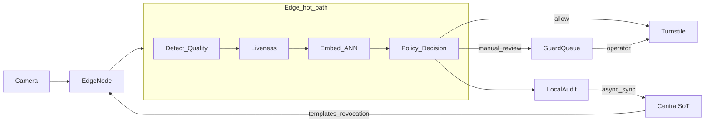
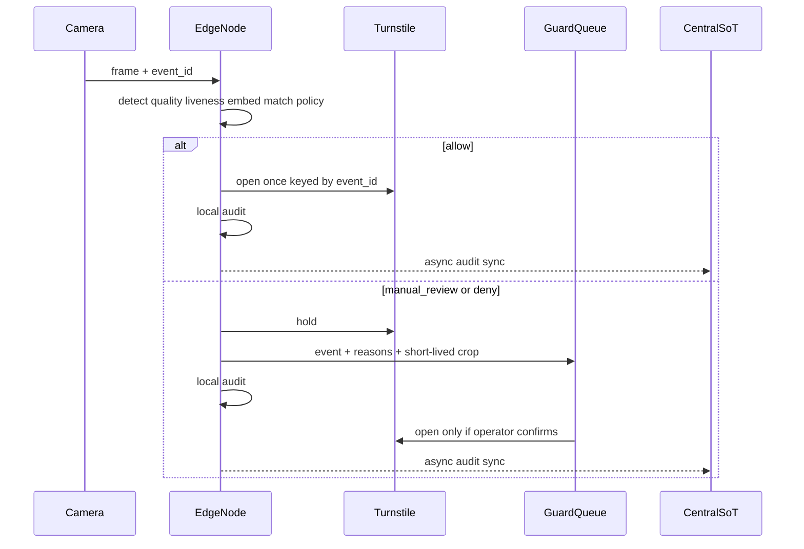

# Архитектура

На кампусе около 12 тысяч сотрудников и три проходные. На каждой две камеры и турникеты. Сейчас все ходят по карте. Утром очередь, забытый пропуск — к охране, карту можно отдать коллеге. Мне нужно ускорить проход и при этом не открыть турникет чужому.

Ниже — как я режу систему на части. Это целевая схема, не готовый прод-СКУД. Что сознательно вынес из первой версии — в конце.

## Главный выбор: где считать лицо

Смотрел три варианта.

**Всё на сервере в центре.** Кадр уезжает на сервер, там ищут лицо, сравнивают с базой и отвечают. Плюс — одна модель, проще обновлять. Минус — уложиться в одну секунду при пике и сетевых задержках уже тяжело. Если интернет отвалился, проходная встаёт. Плюс таскаем биометрию по сети без нужды.

**Всё только у турникета, без центра.** В секунду укладываемся и без сети живём. Но как быстро отозвать доступ уволенному по всем узлам — уже боль. Регистрация лиц и правила «кому куда можно» без единого источника правды быстро разъедутся.

**Гибрид — так и взял.** У проходной считаем весь путь до команды турникету. В центре храним шаблоны и политику доступа, регистрируем сотрудников, быстро рассылаем отзыв, собираем журнал, кормим охрану очередью и раздаём модели. Рабочие кадры в центр по умолчанию не отправляю.

Пик около 20 проходов в минуту на точку — одного небольшого GPU у края хватает с запасом. На 12 тысяч человек простой перебор векторов ещё живой. Если база вырастет до «сотен тысяч», как в масштабе задания, на проходной нужен быстрый индекс (HNSW или похожий), а не полный перебор.

## Из чего система состоит

| Где | Зачем |
|-----|--------|
| Камера | кадр в момент подхода к турникету |
| Компьютер у проходной | найти лицо, проверить качество и «живость», сравнить с базой, решить, открыть или нет, локальный журнал, кеш шаблонов |
| Турникет | команда открыть / подождать, подтверждение, защита от повторной команды |
| Центр | сотрудники, кому куда можно, шаблоны лиц, версия модели |
| Синхронизация | подливать шаблоны; отзыв доступа — в первую очередь и быстро (секунды) |
| Очередь охраны | сомнительные случаи |
| Журнал | решение, scores, причины, что сделала охрана — без сырого кадра по умолчанию |

## Как идёт поток

Коротко по местам: камера даёт кадр; «думать» на горячем пути только у проходной; шаблон лица лежит в центре и копией на узле; решение allow / review / deny принимает локальная policy (иначе offline не взлетит); в центр уходит журнал асинхронно, иногда короткий crop для охраны на несколько минут; охрана не на пути «открыть за 200 мс».

### Успешный проход и уход к охране

## Что синхронно, что потом

На одно событие синхронно, ориентир p95 около 1 секунды: найти лицо → качество → liveness → эмбеддинг → поиск в базе → отрыв от второго → правила доступа и свежесть кеша → команда турникету → запись в локальный журнал.

Как я примерно режу секунду на слабом GPU у края (порядок, не обещание железа):

| Стадия | Бюджет p95 |
|--------|------------|
| найти лицо + качество | ~80–100 мс |
| liveness | ~100–150 мс |
| эмбеддинг | ~250–400 мс |
| поиск + margin | ~30–80 мс |
| правила + команда | ~10–20 мс |
| запас | остаток до 1 с |

Если время раздувается — смотрю эмбеддинг и очередь на железе, а не «ослабим порог, чтобы быстрее пускало». В PoC поле `latency_ms` просто имитирует такой бюджет, без реального sleep, чтобы тесты не тормозили.

Отдельно, не на горячем пути: докинуть журнал в центр, подлить шаблоны, приоритетный отзыв, регистрация лица, обновление моделей, метрики, очередь охраны.

## Где что хранится

1. **Кто сотрудник и куда ему можно** — в центре, на проходной кеш.
2. **Шаблоны лиц (эмбеддинги)** — шифруем, доступ смотрим. Сырые кадры с прохода не архивирую. Фото при регистрации — пока построили шаблон, потом удаляем. Для охраны — короткий зашифрованный crop, потом тоже удаляем.
3. **Индекс поиска** — копия на проходной. На 12k можно без ANN; в целевой схеме — быстрый индекс у края.
4. **Журнал решений** — решение, scores, причины, кого узнали (если узнали), что сделала охрана, сколько заняло. Кадр по умолчанию не кладу. Без сети пишем локально и докидываем, когда связь появилась.

## Турникет и охрана

Команду шлём с ключом события, ждём подтверждение, повтор той же команды не должен второй раз открыть. В PoC железа нет — только поле в ответе и запись в журнал, плюс симулятор ack.

Отдельный красивый UI охраны в первой версии не проектирую. Нужна очередь: событие, причины, scores, при необходимости crop, кнопки «пустить / отказать». В репозитории — JSON, простая страница `/ui/guard` и возможность охраны решить через API. Карта остаётся запасным путём, если лицо ушло в review.

## Если что-то пошло не так

| Ситуация | Что делаем |
|----------|------------|
| Нет лица / плохой кадр | не открываем → охрана или отказ по правилам |
| Сомнительный liveness | охрана |
| Явная подделка | отказ + (в проде) алерт security |
| Модель умерла / индекс сломан | не открываем |
| Нет сети, кеш свежий | работаем по локальной базе |
| Нет сети, кеш старый | даже хороший матч → охрана (кейс e-1005) |
| Тот же event ещё раз | то же решение, второе open не шлём |

Отзыв доступа — отдельный быстрый канал. Полную пересборку индекса делаю фоном, горячий путь не блокирую.

## Что в MVP, чего нет

**В первой версии:** одна проходная; сначала считаем и не открываем (shadow), потом лицо может открывать при уверенности (assist), карта как запасной путь; три исхода; журнал; отзыв.

**Не сейчас:** гости, проход следом за человеком, аналитика очередей, «моргни в камеру» на каждом проходе, полноценный UI охраны, своя модель лиц с нуля.

PoC в репозитории доказывает одно: серая зона и старый кеш **не** открывают турникет, причина видна в журнале. Модели в коде — заглушки; целевой стек — в [ml.md](ml.md). Рядом есть учебная обвязка «как на edge» (ack турникета, revoke, очередь охраны, metrics) — это мост к железу, не замена настоящих моделей.
