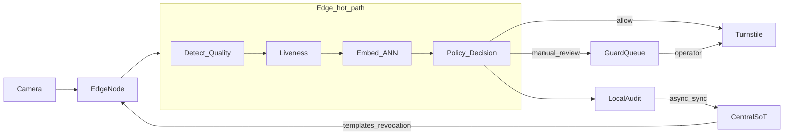
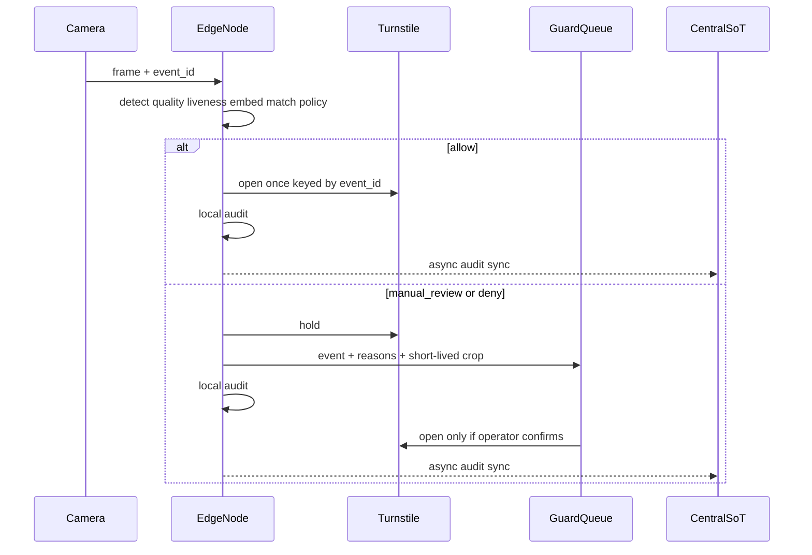

# Архитектура: лицо на проходной

Кампус: ~12k сотрудников, 3 проходные, на каждой 2 камеры и турникеты. Сейчас карта. Утром очередь, забытый пропуск — охрана вручную, карту можно передать коллеге. Нужно ускорить проход и не открыть турникет постороннему.

Ниже — как я это режу на компоненты. Не прод-СКУД, а целевая схема + что сознательно вынес из MVP.

## Главный выбор: где крутится инференс

Смотрел три варианта.

**Всё в центре.** Кадр (или crop) уезжает на сервер, там detect → match → ответ. Плюс: одна модель, проще обновлять. Минус: p95 ≤ 1 с при пике и сетевых джиттерах — уже на грани. Обрыв сети = проходная встаёт. Кадры таскаем по сети — лишняя биометрия в транзите.

**Всё на edge, без центра.** Укладываемся в 1 с и работаем offline. Но отзыв доступа («уволили вчера») размазывается по узлам. Enrollment и политика без SoT — бардак.

**Гибрид, горячий путь на edge.** Так и взял. Edge делает весь путь до команды турникету. Центр — источник правды по шаблонам и политике, enrollment, fanout отзыва, сбор audit, консоль охраны, раздача моделей. Кадры в центр по умолчанию не едут.

Пик ~20 проходов/мин на проходную — один GPU-edge с запасом. На 12k brute-force cosine ещё живой; на «сотни тысяч» (масштаб ТЗ) на edge нужен ANN (HNSW / IVF-PQ), не полный перебор.

## Компоненты

| Где | Что |
|-----|-----|
| Камера | RTSP/кадр в момент подхода к турникету |
| Edge-узел | detect, quality, liveness, embed, ANN/cosine, policy, команда турникету, локальный audit, кеш шаблонов+policy |
| Турникет | команда open / hold, ack, защита от replay |
| Центральный SoT | сотрудники, access policy, biometric templates, версия модели |
| Sync / fanout | инкремент шаблонов, **приоритетный delta отзыва** (секунды), раздача весов |
| Guard queue | сомнительные события → оператор |
| Audit store | решения, scores, reasons, действие охраны — без сырого кадра по умолчанию |

## Поток данных

Где что лежит:

- **камера** — снимок/поток;
- **инференс** — только на edge в горячем пути;
- **biometric template** — SoT в центре + реплика/кеш на edge;
- **решение allow/deny/review** — policy на edge (локально, иначе offline не взлетит);
- **в центр уходит** — audit (async), иногда короткий crop для review (TTL минуты);
- **охрана** — очередь review, не на горячем пути открытия.

### Happy path vs review (sequence)

## Горячий путь (sync) vs async

**Sync, на event_id, бюджет ~1 с p95:** detect → quality → liveness → align/embed → top-k ANN → margin → policy (access + freshness кеша) → turnstile command → локальный audit.

**Async:** sync audit в центр; fanout шаблонов и политики; приоритетный отзыв; enrollment (фото → шаблон → purge фото); обновление моделей; агрегация метрик; очередь охраны.

## Хранилища (четыре штуки)

1. **База сотрудников / access policy** — кто имеет право на какую проходную, статусы, сроки. SoT в центре, кеш на edge.
2. **Biometric templates (эмбеддинги)** — encryption at rest, доступ аудируется. Runtime-кадры не складываем. Enrollment-фото транзиентно. Для review — зашифрованный crop на минуты, потом purge.
3. **ANN-индекс** — реплика на edge из центрального снимка. На 12k можно жить без ANN; в целевой схеме — HNSW на edge.
4. **Audit log** — decision, scores, reasons, employee_id (если есть), operator action, latency. Без сырого кадра по умолчанию. Offline: пишем локально, докидываем в центр при связи.

## Турникет

Edge шлёт команду с ключом `event_id` (или `decision_id`). Нужны ack и защита от повторной отправки той же команды. Идемпотентность: один event — максимум одно успешное open. В PoC железа нет — только поле `turnstile_command` и запись в audit.

## Охрана

Не проектирую UI. Нужна очередь: событие, reasons, scores, опционально crop, кнопки «пропустить / отказать». В PoC — JSONL + вывод demo. В assist-режиме карта остаётся fallback, если лицо ушло в review.

## Деградация и offline

| Ситуация | Поведение |
|----------|-----------|
| Нет лица / плохой quality | не open → manual_review или deny по правилам |
| Сомнительный liveness | manual_review |
| Явный spoof | deny + security alert |
| Нет модели / индекс битый | не open, fail-closed |
| Offline, кеш свежий | работаем по локальным шаблонам+policy |
| Offline, `cache_age` выше порога | даже хороший match → **manual_review** (отзыв мог не доехать — кейс e-1005) |
| Повтор того же event_id | то же решение, второе open не шлём |

Отзыв доступа — отдельный быстрый канал (секунды). Полная пересборка индекса — инкрементально, не блокирует горячий путь.

## MVP vs дальше

**MVP:** одна проходная; shadow → assist (карта fallback); три исхода; audit; отзыв; карта как запасной путь.

**Не в MVP:** гости, tailgating, аналитика очередей, active liveness, multi-site ANN «из коробки», нормальный UI охраны, своя FR-модель.

PoC в репо доказывает только инвариант политики: серая зона и stale cache **не** открывают турникет, причина видна в audit. Модели — mock/fixture; целевой стек — в [ml.md](ml.md).
