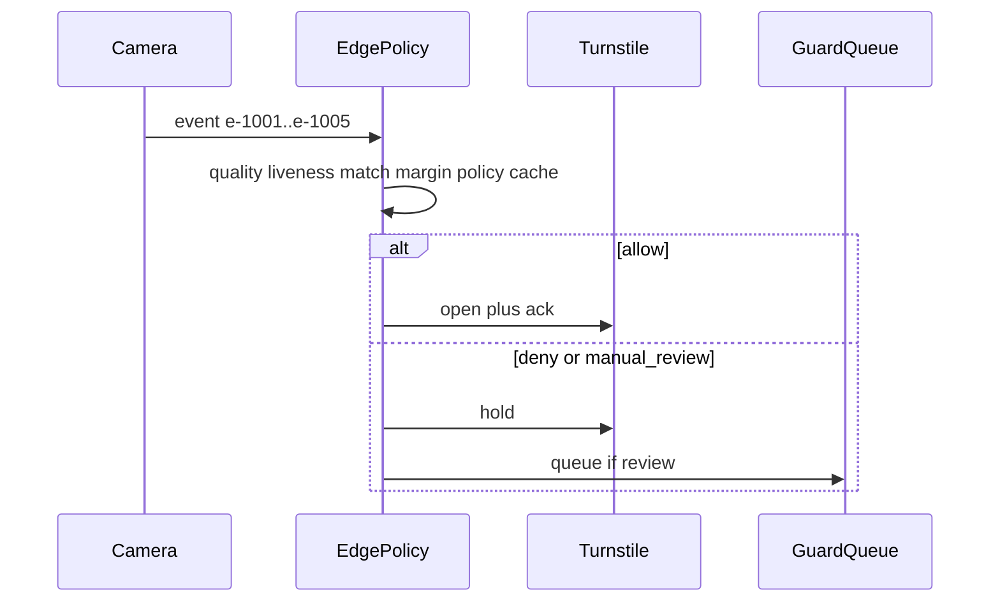
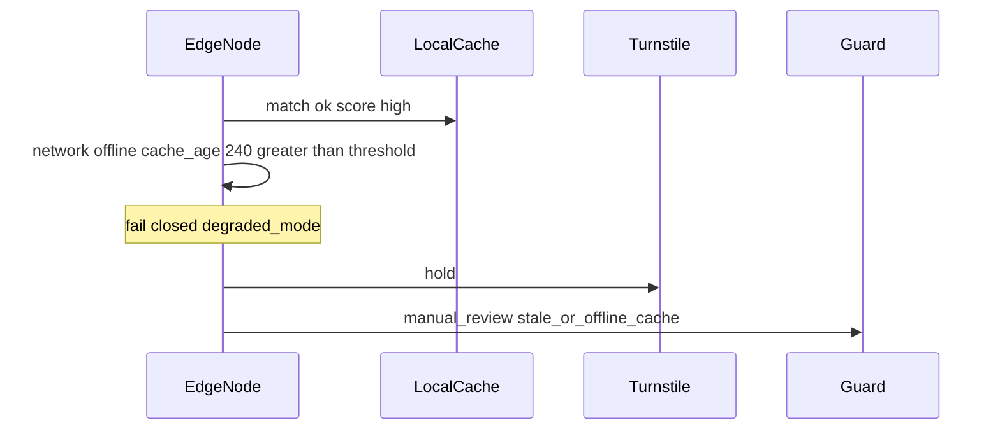

# Разбор пяти референсных событий

Как читаю кейсы из ТЗ и что делает PoC. Правило одно: **серая зона и деградация не открывают турникет**.

Пороги живут в `poc/app/decision.py`. Scores для демо — в `poc/data/events.json` (fixture), чтобы сценарии были детерминированными.

## Сводная таблица

| event | Смысл в ТЗ | decision | turnstile | Главная причина |
|-------|------------|----------|-----------|-----------------|
| e-1001 | хороший проход | `allow` | `open` | все гейты зелёные |
| e-1002 | маска + контровый свет | `manual_review` | `hold` | `quality_below_threshold` |
| e-1003 | фото с экрана (spoof) | `deny` | `hold` | `liveness_spoof_suspected` |
| e-1004 | два близких кандидата | `manual_review` | `hold` | `margin_too_small` |
| e-1005 | offline + старый кеш | `manual_review` | `hold` | `stale_or_offline_cache` + `degraded_mode` |

Проверка: `pytest poc/tests -q` и `python scripts/demo.py`.

---

## e-1001 — типовой проход

**Ситуация:** нормальный свет, сеть online, лицо «своё» с хорошим отрывом от второго.

**Почему allow:** quality ок → liveness ок → score ≥ T_allow → margin ≥ M_min → policy пускает → кеш свежий.

**Что уходит наружу:** `turnstile_command=open`, симулятор отвечает `opened` (ack). В audit — reasons без кадра.

**В проде то же правило**, только scores даёт реальный пайплайн, а не fixture.

---

## e-1002 — плохое качество (маска / backlight)

**Ситуация:** кадр плохой. Даже если «где-то в базе похоже», открывать опасно: матч на мусоре раздувает и FA, и странные FR.

**Почему review:** `quality_score` ниже `Q_MIN` → сразу `manual_review`, до матча как доверительного сигнала не доходим в смысле allow.

**Турникет:** hold. Событие в `/v1/guard/queue` — охрана / карта.

**Компромисс:** чуть больше ручных разборов утром vs риск пустить по размытому кропу.

---

## e-1003 — spoof (экран телефона)

**Ситуация:** атака презентацией. FAR здесь бьёт в безопасность контура.

**Почему deny:** liveness в зоне spoof (`≤ L_SPOOF`) → `deny`, не review. Review был бы для «серого» liveness; явный spoof — стоп + (в проде) security alert.

**Турникет:** hold. Авто-open исключён.

**Важно на словах:** в PoC liveness — mock score. В целевой архитектуре — passive PAD на edge; active challenge не на happy path (латентность).

---

## e-1004 — низкий margin (два кандидата)

**Ситуация:** top-1 вроде проходит по score, но top-2 почти рядом. Типичный twin / похожий ракурс.

**Почему review:** `margin < M_min` → не allow. Один порог по score недостаточен для 1:N.

**Турникет:** hold. Охрана может открыть через `/v1/guard/review/e-1004` после проверки — в prod-shaped слое это смоделировано.

**Зачем так:** лучше очередь на 1 человека, чем перепутать двух сотрудников или пустить «почти того».

---

## e-1005 — offline + устаревший кеш

**Ситуация:** сеть offline, `cache_age_minutes=240`. Match может быть «красивым», но вчера человека уволили — отзыв мог не доехать.

**Почему review + degraded_mode:** даже при зелёных quality/liveness/match/margin/policy срабатывает правило свежести кеша. Auto-open при гнилом кеше = дыра в отзыве доступа.

**В проде:** приоритетный delta отзыва (секунды); пока fanout не подтверждён — не опираемся на auto-allow по старому снимку.

**Связка с revoke в PoC:** `POST /v1/admin/revoke` снимает шаблон с edge; после этого даже «хороший» fixture-match на этого employee не должен открывать — шаблона уже нет в кеше.

---

## Чему это учит (для защиты)

1. Три исхода нужны: между «впустить» и «запретить навсегда» есть охрана.  
2. FAR дороже FRR — allow только при полном пересечении гейтов.  
3. Offline ≠ «работай как online»; stale cache — отдельный риск.  
4. PoC проверяет **политику**, не качество нейросети. Модели в целевой схеме — в `docs/ml.md`.
