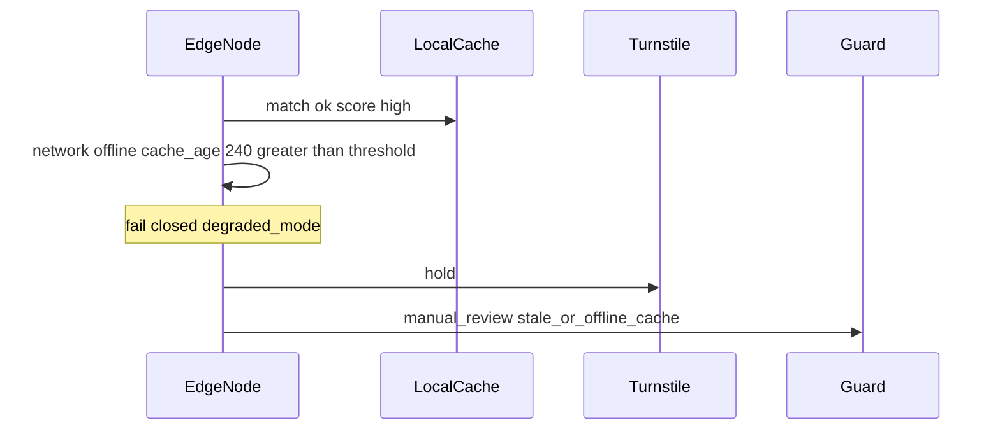

# Разбор событий из задания

Ниже — как я читаю кейсы из ТЗ и что делает PoC. Одно правило на все: если сомневаемся или база на проходной уже старая — турникет сам не открываем. Событие уходит охране, причина видна в журнале и на странице `/ui/guard`.

Пороги лежат в `poc/app/decision.py`. Числа для демо — в `poc/data/events.json`, чтобы прогон был стабильным и не зависел от «игрушечной» модели.

## Сводная таблица

| Событие | О чём речь | Решение | Турникет | Главная причина |
|---------|------------|---------|----------|-----------------|
| e-1001 | нормальный проход | открыть | open | всё зелёное |
| e-1002 | маска / плохой свет | к охране | hold | плохое качество |
| e-1003 | фото с экрана | отказать | hold | spoof |
| e-1004 | два похожих кандидата | к охране | hold | маленький отрыв |
| e-1005 | нет сети + старый кеш | к охране | hold | stale / offline |
| e-1006 | лица в кадре нет | к охране | hold | no_face |
| e-1007 | liveness «так себе» | к охране | hold | uncertain liveness |

Проверка: `pytest poc/tests -q`, `python scripts/demo.py`. Сценарий с уходом к охране отдельно: `pytest poc/tests/test_scenario7.py -q`.

---

## e-1001 — обычный хороший проход

Свет нормальный, сеть есть, человек «свой», отрыв от второго кандидата достаточный. Цепочка качества и liveness проходит, похожесть высокая, политика пускает, кеш свежий — открываем. В журнале пишем причины, кадр не кладём. В проде то же правило, только числа даст настоящий пайплайн, а не файл.

## e-1002 — плохой кадр

Маска и контровый свет. Даже если «вроде похож на кого-то в базе», открывать опасно: можно промахнуться по мусору. Качество ниже порога — сразу к охране, турникет ждёт. Компромисс простой: чуть больше ручных разборов утром вместо риска пустить по плохому кропу.

## e-1003 — подделка с экрана телефона

Это уже не «серая зона», а подозрение на атаку. Liveness очень низкий — отказываем, не отправляем в мягкий review. Авто-открытия нет. Важно: в PoC liveness — заглушка. В целевой системе на проходной стоит нормальный anti-spoof; просить моргать каждого утром не хочу — очередь важнее.

## e-1004 — два почти одинаковых кандидата

Лучший score вроде проходит, но второй рядом. Одного порога «насколько похож» для поиска по базе мало — можно перепутать людей. Поэтому к охране. Лучше задержать одного человека, чем открыть «почти тому».

## e-1005 — нет сети и старый кеш

Матч может быть красивым, но человека вчера могли уволить, а отзыв до узла не доехал. Даже если качество и похожесть зелёные — не открываю, ставлю режим деградации и зову охрану. В проде отзыв должен лететь приоритетно за секунды. В PoC отзыв шаблона можно смоделировать через `POST /v1/admin/revoke`.

## e-1006 — лица нет

Человек отвернулся, камера мимо, пустой кадр. Не угадываем «по фону» — сразу к охране с причиной «лицо не найдено». В проде тот же гейт после настоящего детекта, не после флажка в JSON.

## e-1007 — liveness сомнительный, но не spoof

Качество нормальное, матч мог бы пройти, но «живость» между порогом spoof и порогом allow. Явной подделки нет — поэтому не `deny`, а охрана. От e-1003 отличие как раз в этом: там отказ жёсткий, здесь ручная проверка.

## Сценарий №7 целиком

Все рискованные ветки сходятся в одно поведение: турникет не открылся сам, решение «к охране», в журнале есть причины, событие видно в очереди и на `/ui/guard`.

В PoC scores из файлов. В целевой системе — реальные модели у проходной и нормальная консоль для поста. Страницу и review-API я добавил для демо; для задания хватало бы и причин в логе.

## Что из этого вынесу на защиту

Между «впустить» и «запретить навсегда» нужна охрана. Ложно пустить чужого хуже, чем лишний раз отказать своему. Offline — это не «работай как будто сеть есть». PoC показывает правила, а не качество нейросети — модели описаны в [ml.md](ml.md).
